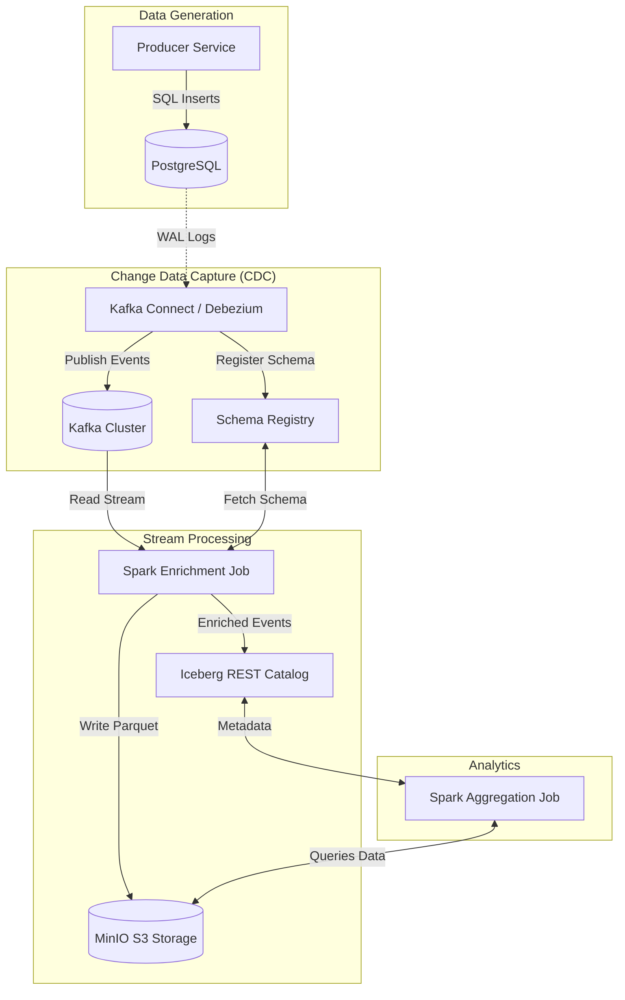

# DocStream Real-Time Data Pipeline

    

## Overview

A real-time data pipeline that captures Change Data Capture (CDC) events from PostgreSQL, processes them through Apache Spark Structured Streaming, and stores results in Apache Iceberg tables with real-time indexing to Elasticsearch.

