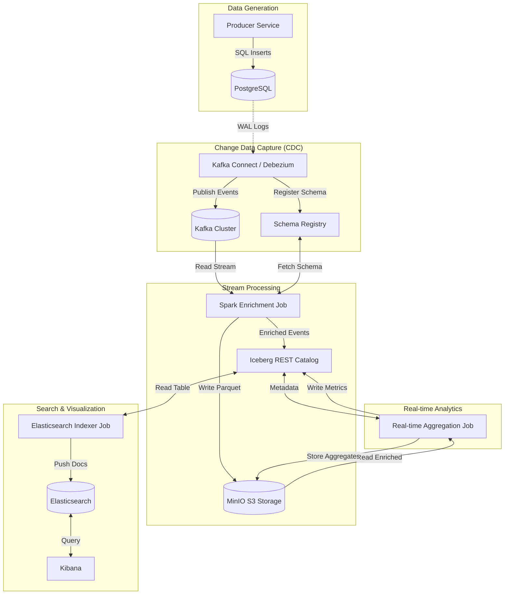

# DocStream Real-Time Data Pipeline

    

## Overview

A real-time data pipeline that captures Change Data Capture (CDC) events from PostgreSQL, processes them through Apache Spark Structured Streaming, and stores results in Apache Iceberg tables with real-time indexing to Elasticsearch.

## System Services

| Service | URL | Description |
| :--- | :--- | :--- |
| **Kafka UI** | [http://localhost:8082](http://localhost:8082) | Monitor Kafka topics, consumers, and connectors |
| **Spark Master** | [http://localhost:8080](http://localhost:8080) | Monitor Spark jobs and worker status |
| **MinIO Console** | [http://localhost:9001](http://localhost:9001) | S3 object storage (User: `admin`, Pass: `password`) |
| **Kibana** | [http://localhost:5601](http://localhost:5601) | Visualize data in Elasticsearch |
| **Elasticsearch** | [http://localhost:9200](http://localhost:9200) | REST API for search and analytics |
| **Iceberg REST** | [http://localhost:8181](http://localhost:8181) | Iceberg catalog management |